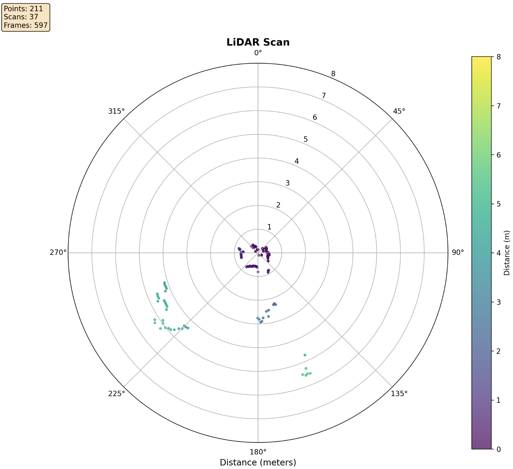
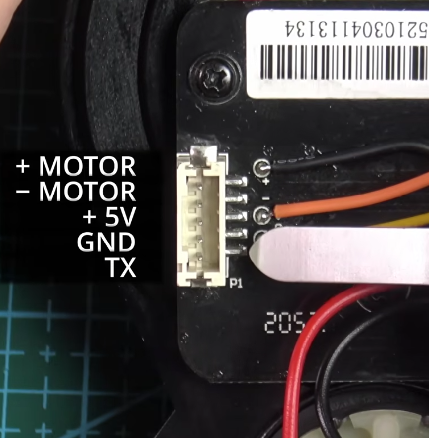
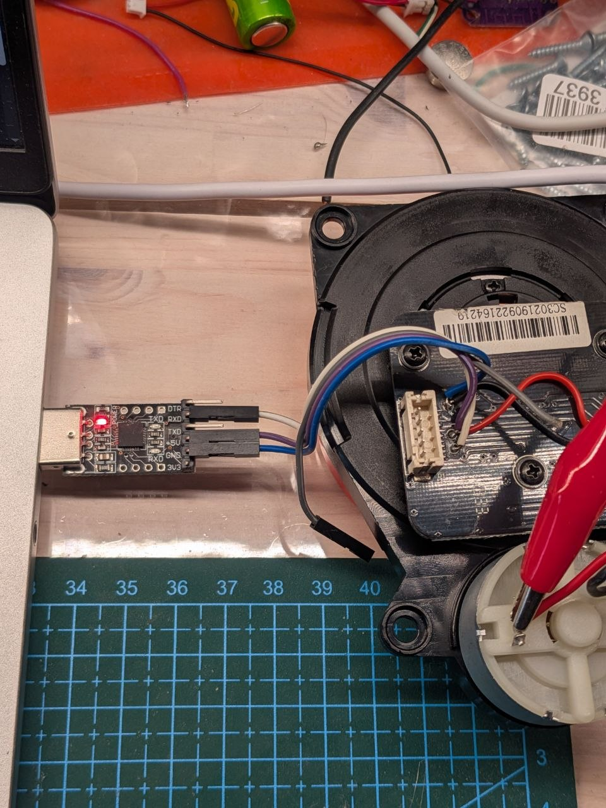

# STYTJ02YM-lidar-utils

Simple vibecoded util to draw a plot from a data that comes from lidar via serial port /dev/ttyUSB0 (adjust)

Lidar connected with cheap USB-Serial adapter, motor connected to 3V DC, 5V make it speen to fast and the lidar show error.

###Useful Links
- Thanks to the video https://www.youtube.com/watch?v=S_xONJO4-Q0 that explain a lot
- Serial data explanation https://notblackmagic.com/bitsnpieces/lidar-modules/
